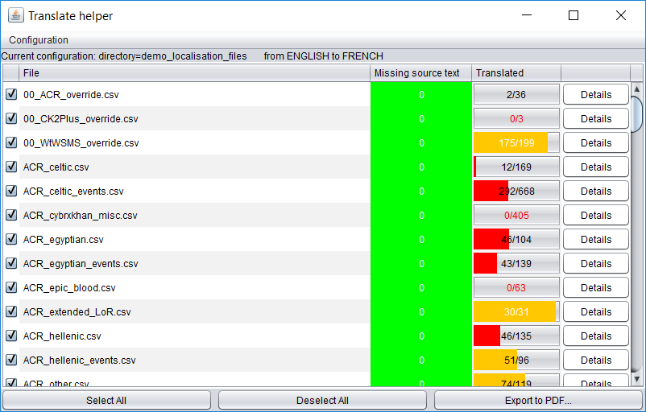
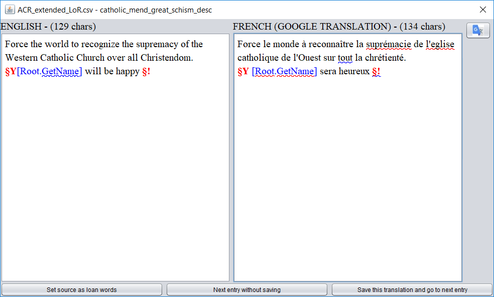

# Translate_helper
An application to help to translate the Paradox games localisation files.

# Diagnostic of a localisation directory
* Define a source and optionally a destination language
* Visualize the number of useful lines with no source text, and with no translation (no text or invalid text like FRENCH or copy of the source text)
* See this with a summary by files in a table
* See the details for each file
* Share this diagnostic by generating a pdf report (select the files which will be appear into it)

# Translation
* See the source and the destination text
* Write or fix the destination with spell and grammar checking
* Skip entries to translate if you wish
* Save source text as loan word

# How to use it
* Install Java if you have not already done it (you can google "donwload Java" to find the download link)
* Download the [lastest release](https://github.com/NicolasGrosjean/Translate_helper/releases)
* Double-click on Script_translate_helper.bat or directly on TranslateHelper.jar if you have put java in your PATH
* The application is configured with a demo. You can modify it and add your own configurations with the Configuration menu

# Advanced used
* Add in the file config/accepted_loanwords.txt the accepted loanwords (= expression which can be both in the source and destination language) (add them one by line)
* Add in the file config/fake_translations.txt the expressions which are not translation (ex: FRENCH) (add them one by line)
* Add in the file config/available_languages.csv new language by adding the column number (start by 0), the language name and the 2 letters of the language code

# Used librairies
* itextpdf: Create a pdf for the export to pdf
* jdom: Read and write XML for the config files
* languagetool: Check spelling and grammar. Like the creator asked, I have let their full packages in the directory jars/